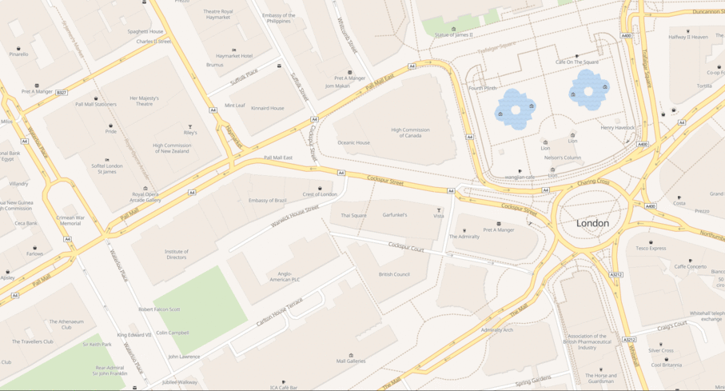

# Sequentially Generate Planet Mbtiles

### _Sequentially generate and merge an entire planet.mbtiles vector tileset on low memory/power devices for free._




**v3.1.0-rc3 currently in testing. see [pre-release](https://github.com/lambdajack/sequentially-generate-planet-mbtiles/releases/tag/v3.1.0-rc3). Feedback in any form is always appreciated.**

## TL;DR give me planet vector tiles! (usage)

1. Have [Docker](https://docs.docker.com/get-docker/) installed.

2. ```bash
   git clone --recurse-submodules https://github.com/lambdajack/sequentially-generate-planet-mbtiles
   ```

3. ```bash
   cd sequentially-generate-planet-mbtiles && \
   sudo ./release/v2.2.0-sequentially-generate-planet-mbtiles.exe
   ```

4. Rejoice - see acknowledgements below for people to thank.

## config.json (defaults shown)

#### config supplied with the -c flag:

```bash
 sudo ./release/v2.2.0-sequentially-generate-planet-mbtiles.exe -c /path/to/config.json
```

```json
// config.json
{
  "dataDir": "",
  "TilemakerConfig": "",
  "TilemakerProcess": ""
}
```

**_dataDir_** - This will be where the program stores all data downloaded and generated. Need approx 300GB space. If none is provided a 'data' folder will be created in the current working directory.

**_TilemakerConfig_** - The config file that will be passed to [Tilemaker](https://github.com/systemed/tilemaker). See the default used [here](https://github.com/lambdajack/tilemaker/blob/b90347b2a4fd475470b9870b8e44e2829d8e4d6d/resources/config-openmaptiles.json).

**_TilemakerProcess_** - The process file that will be passed to [Tilemaker](https://github.com/systemed/tilemaker). See the default used [here](https://github.com/lambdajack/tilemaker/blob/b90347b2a4fd475470b9870b8e44e2829d8e4d6d/resources/process-openmaptiles.lua).

Note the files used are slightly adjusted from the examples provided by Tilemaker to give a pleasant default presentation when used with [TileServerGL](https://github.com/maptiler/tileserver-gl).

## Why?

There are some wonderful options out there for generating and serving your own map data and there are many reasons to want to do so. My reason, and the inspiration for this programme was cost. It is expensive to use a paid tile server option after less users using it than you might think. The problem is, when trying to host your own, a lot of research has shown me that almost all solutions for self generating tiles for a map server require hugely expensive hardware to even complete (it's not uncommon to see requirements for 64 cores and 128gb RAM!). Indeed the largest I've seen wanted 150gb of the stuff!. For generating the planet that is. If you want a small section of the world, then it is much easier. But I need the planet - so what to do? Generate smaller sections of the world, then combine them.

That's where [sequentially-generate-planet-mbtiles](https://github.com/lambdajack/sequentially-generate-planet-mbtiles) comes in. It downloads the latest osm data, splits it into manageable chunks, generates mbtiles from those chunks and then stitches it all together.

**_This programme aims to be a simple set and forget, one liner which gives anyone - a way to get a full-featured and bang up to date set of vector tiles for the entire planet on small hardware._**

It's also designed (work in progress) to be fail safe - meaning that if your hardware (or our software) does crash mid process, you have not lost all your data, and you are able to start again from a point mid-way through.

This also uses the openmaptiles mbtiles spec, meaning that when accessing the served tiles you can easily use most of the open source styles available. The default is aimed at using the OSM Bright style. More information on styles can be found below.

## Considerations

1. Hardware usage - this will consume effectively 100% CPU for up to a few days and will also do millions of read/writes from ssd/RAM/CPUcache. While modern hardware and vps' are perfectly capable of handling this, if you are using old hardware, beware that its remaining lifespan may be significantly reduced.
2. Cost - related to the above, while this programme and everything it uses is entirely free and open source - the person's/company's computer you're running it on might charge you electricity/load costs etc. Please check with your provider, how they handle fair use.
3. Time - your hardware will be unable to do anything much other than run this programme while it is running. This is in order to be efficient and is by design. If your hardware is hosting other production software or will be needed for other things in the next few days, be aware that it will perform suboptimally while this is running.
4. Bandwidth - this will download the entire planet's worth of openstreetmap data directly from OSM. At the time of writing, this is approx. 64GB. **Please note: ** the programme will look for a `planet-latest.osm.pbf` file in the `data/pbf` folder. If this is already present, it will skip the download and use this file. If you already have the data you wish to generate mbtiles for, you can place it there to skip the download. This can be useful if you want historical data, or are generating the mbtiles on multiple computers.
5. Data generation - in order to remain relatively fast on low spec hardware, this programme systematically breaks up the OSM data into more manegable chunks before processing. Therefore, expect around 300GB of storage to be used up on completion.

## Requirements

### Hardware

1. About 300GB clear disk space for the entire planet. Probably an SSD unless you like pain, suffering and the watching the slow creep of old age.
2. About 4gb of clear RAM (so maybe 6gb if used on a desktop pc). We are working on options in the future for lower RAM requirements.
3. Time. As above, this has been written to massively streamline the process of getting a planetary vector tile set for the average person who might not have the strongest hardware or the desire to spend £££ on a 64 core 128gb RAM server. Unfortunately, if you cut out the cost, you increase the time. Expect the process to take a couple of days from start to finish on average hardware.

### Software

1. Have [Docker](https://www.docker.com/) installed.

# Serving mbtiles

## Software

We would recommend something like [tileserver-gl](https://github.com/maptiler/tileserver-gl). Further reading can be found on the [openstreetmap wiki](https://wiki.openstreetmap.org/wiki/MBTiles).

You can quickly serve using tileserver-gl:

```bash
docker run --rm -it -v $(pwd)/data:/data -p 8080:80 maptiler/tileserver-gl
```

## Styles

The default output of `sequentially-generate-planet-mbtiles` looks to match with the open source OSM ['Bright'](https://github.com/openmaptiles/osm-bright-gl-style/blob/master/style.json) style.

When accessing your tileserver with something like [MapLibre](https://maplibre.org/maplibre-gl-js-docs/api/) from a front end application, a good place to start would be passing it a copy of the above ['Bright'](https://github.com/openmaptiles/osm-bright-gl-style/blob/master/style.json) style, **making sure to edit the urls to point to the correct places**.

You can edit the output of `sequentially-generate-planet-mbtiles` by providing a customised process or config file through the config file.

### Style first considerations

If making your own style or editing an existing one, note that `sequentially-generate-planet-mbtiles` by default will write text to the `name:latin` tag. If your maps are displayed, but missing text, check that your style is looking for `name:latin` and not something else (e.g. simply `name`).

Pay attention to your fonts. The OSM Bright style makes use of Noto Sans variants (bold, italic & regular). If you are using tileserver-gl to serve your tiles, it only comes with the regular variant of Noto Sans (not the bold or the italic); therefore, it may look like text labels are missing since the style won't be able to find the fonts. You should therefore consider editing the style and changing all mentions of the font to use only the regular variant. Alternatively, you could ensure that all fonts necessary are present.

**Further to the above, please find in this repo, a slightly [edited](./configs/styles/sgpm-bright.json) OSM Bright style for use with the default tileserver-gl. Feed this to your MapLibre or similar front end for a pleasent map suitable for most use cases.**

## FAQ

1. **How long will this take?** Low spec hardware? Whole planet? A few days. Maybe less than 48 hours for 16 CPUs.
2. **Would I use this if I have powerful hardware?** Maybe. Since the programme essentially saves its progress as it goes, even if you have strong hardware, you are reducing the time taken to redo the process in the event of a crash or file corruption. Further, the RAM is what is really saved here so if you have say 32 cores and 64gb RAM, you still would not be able to generate the entire planet by loading it into memory. Additionally, it just saves time configuring everything.
3. **Why do I have to run part of the programme with 'sudo' privileges?** Many docker installations require sudo to be executed. You may not have to execute the programme with sudo.
4. **Do I have to download the entire planet?** At present, yes. Since if you are not downloading the entire planet, there are other tools out there which do a fine job of getting you mbtiles. We are working on being able to generate mbtiles for smaller areas (such as continents which may still not fit into the average computers RAM)
5. **Does 'low spec' mean I can run it on my toaster?** Maybe, but mostly not. But you can happily run it on you 4core CPU/4gb RAM home pc without too much trouble. Just time.
6. **Didn't this used to use GeoFabrik?** It did but the plan was always to move away from geofabrik sources for the planet since it felt unnecessary, when the data was already available direct from source. Further, the GeoFabrik data leaves gaps in the ocean and some of their slices require more than 4gb RAM to process in memory. Ultimately, by getting the data from source, we have more control over it.
7. **Why would I use this over Planetiler?** Planetiler is a fantastic project, however it still requires minimum 32gb RAM to complete the entire planet (0.5x the size of the planet pbf file).

## Acknowledgements

Please take the time to thank the folks over at [tilemaker](https://github.com/systemed/tilemaker), [tippecanoe](https://github.com/mapbox/tippecanoe) and [osmium](https://github.com/osmcode/libosmium). They are the reason any of this is possible in the first place. It goes without saying, our thanks go out to [OpenStreetMap](https://www.openstreetmap.org/copyright).

## Attribution

Please attribute openmaptiles, openstreemap contributors and tippecanoe if any data derived from this programme is used in production.

## Licenses

Files generated by `sequentially-generate-planet-mbtiles` are subject to the licenses described by [tippecanoe](https://github.com/mapbox/tippecanoe) and [OpenStreetMap](https://www.openstreetmap.org/copyright).

`sequentially-generate-planet-mbtiles` is subject to the MIT [license](LICENSE).

## Contributions

All welcome! Feature request, pull request, bug reports/fixes etc - go for it.
